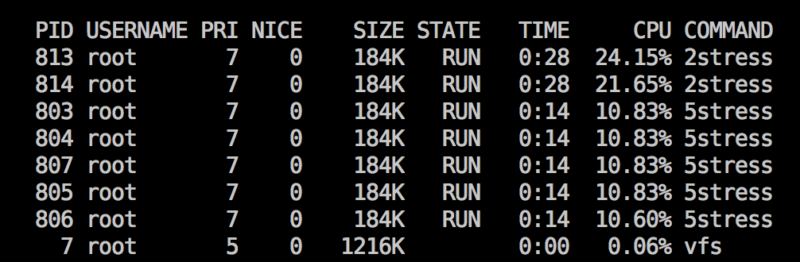

Fair-Share Scheduling στο Minix
===============================

Κωστής Καραντίας \<<cse32454@cs.uoi.gr>\> (2454)

## Υλοποίηση
### `schedproc`
Ο sched πρέπει να γνωρίζει για τα νεα πεδία που θέλουμε να
χρησιμοποιήσουμε. Επομένως έχω προσθέσει τα νεα πεδία (`procgrp`,
`proc_usage`, `grp_usage`, `fss_priority`) στη δομή `schedproc` (αρχείο
`servers/sched/schedproc.h`).

Έχω επίσης τροποποιήσει την `sched_inherit` του pm ώστε να περιλαμβάνει
το `procgrp` στο μήνυμα που στέλνει στο `sched` (αρχεία
`lib/libsys/sched_start.c`, `servers/pm/schedule.c`).

### `do_start_scheduling`, `do_noquantum`
Ενημερώνω τα πεδία των user processes κατάλληλα κατά το
`do_start_scheduling` και `do_noquantum` (αρχείο
`servers/sched/schedule.c`).

### Ενημέρωση πυρήνα
Ο πυρήνας πρέπει να γνωρίζει για το καινούριο `fss_priority` που έχουμε
υιοθετήσει, γι'αυτό ορίζω ένα `p_fss_priority` field στο `struct proc`
(αρχείο `kernel/proc.h`).

Έπειτα τροποποίω τη `sched_proc` ώστε να μπορώ να ενημερώνω τον kernel
για αλλαγές στο `fss_priority` των διεργασιών, επίσης την
`sys_schedule` και `schedule_process` που αλυσιδωτά καλούν την
`sched_proc` (αρχεία `kernel/system.c`, `lib/libsys/sys_schedule.c`,
`servers/sched/schedule.c`).

### Μοναδικό user queue
Μείωσα τον συνολικό αριθμό queues σε 8, και έθεσα το `MAX_USER_Q` σε 7
(αρχείο `include/minix/config.h`).
Αυτό σημαίνει ότι κάθε user process θα έχει priority 7, με άλλα λόγια
θα βρίσκεται στο ready queue 7.

### Επιλογή user process με το ελάχιστο `fss_priority`
Υλοποιείται στην `pick_proc`, όπου όταν πρόκειται να διαλεχτεί
διεργασία χρήστη, ψάχνει όλες τις διεργασίες στο `USER_Q` για να βρει
αυτή με το μικρότερο `fss_priority` (αρχείο `kernel/proc.c`).

## Testing
### POSIX-compliance tests
Ο πυρήνας ως έχει περνάει τα POSIX-compliance tests στο
`/usr/src/test`.

### Stress test
Υλοποίησα ένα εργαλείο για να δω το fair share scheduling στην πράξη
και για να το τεστάρω πιο εύκολα. Λέγεται `stress` και απλά δημιουργεί
όσα child processes ορίσει ο χρήστης που κάνουν `while(1)` για πάντα.

```c
#include <stdio.h>
#include <unistd.h>
#include <sys/types.h>
#include <sys/wait.h>

void stress(int child_id) {
	printf("Running stress child %d.\n", child_id);
	while (1);
}

int main(int argc, char **argv) {
	int n_children, i;

	sscanf(argv[1], "%d", &n_children);
	printf("Running stress test with %d children.\n", n_children);

	for (i = 0; i < n_children; ++i) {
		if (fork() == 0) {
			stress(i);
			break;
		}
	}

	waitpid(-1, NULL, 0);

	return 0;
}
```

Επίσης έφτιαξα ένα script που να τρέχει το `stress` αλλά με την
κατάλληλη ονομασία για να μπορώ να ξεχωρίσω ποιο stress test είναι
ενεργό σε εργαλεία όπως πχ. το `top`.

```sh
#!/bin/sh

clang stress.c -o /tmp/$1stress && /tmp/$1stress $1
```

Ένα στιγμιότυπο από το stress test στο top:



### Minix compilation
Ο πυρήνας επίσης μπορεί να κάνει compile τον εαυτό του επιτυχώς. Καθώς
το `make world` είναι μια πολύ εξειδικευμένη διαδικασία που είναι
child-heavy αυτό αποτελεί μια πολυ καλή ένδειξη για τη σταθερότητα του
πυρήνα.
